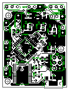

# temp(erature)-cont(roller)

An very small atemga328 based temperature controller that can be used to incubate animals :lizard: :honeybee: :hatching_chick: and plants :rose: :cactus:. 
It uses up to five ds18b20 temperature probes connected into a single audio jack to monitor temperature.
Heating can be provided through any 5v-12vDC heating source.  I use the 12v rail of a spare computer power supply.
The board connects to any computer over usb serial and prints the temperature statuses in Json about every second.  The 
default temperature can be changed while running and is stored in EEPROM to survive power offs.  The target temperature 
can also be set without writing to EEPROM.  This is useful when using a secondary application to maintain a temperature profile.
Right now the temperature can only be set with integers.

Set the target temperature to 91F and write the value to EEPROM to persist across power offs.
```json
{"a":"tgt","tgt":91} 
```

Set the target to 100F and do not write the value to EEPROM.  The target temperature will revert back to what is stored in EEPROM if powered off and back on.
```json
{"a":"tgt_tmp","tgt":100}
``` 
Top layer of the board, about life size.  


In this project, I use a [simple nodejs](nodejs/src/main/controller/index.js) application to maintain a temperature profile
that changes with each hour of the day.
Programming is done over a mini-usb (ftdi) or via isp headers.  


Right now I've got the board hooked up to a raspberry pi running the [nodejs controller](nodejs/src/main/controller) container which
maintains a temperature profile and sends the output of the board to a personal splunk instance for graphing. 


Honestly, the board isn't all that impressive and neither is the temperature controller code.  Its a basic temperature controller that averages
the temperature readings of one or more ds18b20 probes and turns a 12V heating element on or off based off whether the temperature
is above or below the desired target tempature.  It also checks to make sure the fan that blows air through the heater element is
running.  If the fan isn't turning the heating element will shutdown. 
 
What is interesting, I think, is the way that updates are deployed.

- Board code is tested locally on the workstation and once confirmed as working then
- The code is pushed to github.
- The github webhook calls out to Jenkins on the same private network as the temperature controller.
- The Jenkins instance creates a build container
- The build container then packages up the arduino code into an avr-dude container and sends it to a raspberry pi that the temperature controller is connected to via usb.
- The build container requests that the container start then
- At container start, the temperature controller code is compiled within the avr-dude container on the remote raspberry pi and then deployed to the temperature controller board.


Why the additional complexity with docker?  Mostly to take advantage of an immutable system that is easy to recover.
If the raspberry pi SD fails (which they infrequently do) I can quickly stand up a new raspberry pi with the docker REST api exposed using a simple ansible script.
Once the REST api is exposed and the raspberry pi is placed back on the network, jenkins can deploy both the temperature controller board code (if necessary) and the application that manages the temperature profile.

Since I don't keep my incubator near my workstation, having a deployment pipeline that can update both the firmware and
secondary application that controls the temperature profile to remote locations is super awesome.  I don't have to lug
my laptop around just to add a feature or set a default temperature.


Hopefully some portion of this project will be useful to you :)  

#### Things that will be done over the next several months.
- [ ] Remove the serial display jumper in favor of another 5V fan jumper.  
- [ ] Add an additional mosfet for the additional fan.  
- [ ] Better isolate the two fan jumpers, provide their own 5v separate from atmega board to reduce noise.  
- [ ] Move the mosfet gate pins onto analog output pins.  Right now the heater can only be off or on.  
- [ ] Remove the ftdi programmer pads from the bottom of the board.  
- [x] Update the NodeJs application to write to a splunk endpoint.  
- [ ] Add a jumper for the heater mosfet gate that can be used to drive an external AC mosfet.   


      

